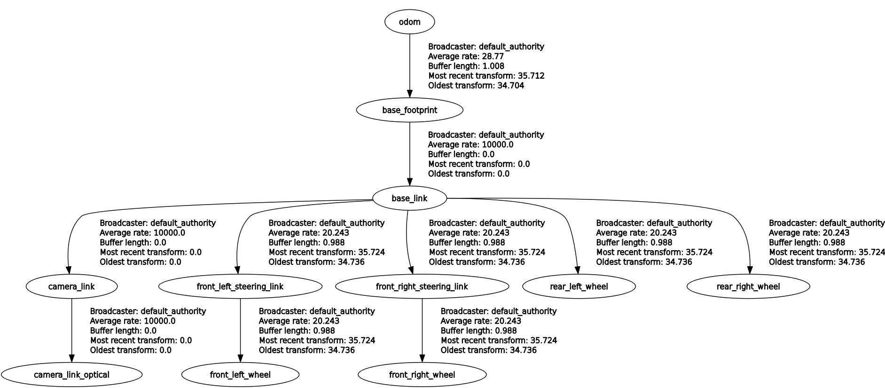

# Simulation of self-steering racecar in gazebo #

## Table of Contents ##
- [Simulation of self-steering racecar in gazebo](#simulation-of-self-steering-racecar-in-gazebo)
  - [Table of Contents](#table-of-contents)
  - [Project Descripton](#project-descripton)
  - [Prerequisites](#prerequisites)
  - [Models](#models)
    - [Racetrack](#racetrack)
    - [Racecar](#racecar)
  - [Implementation of the Ackermann steering](#implementation-of-the-ackermann-steering)
  - [Image Processing and Self-Steering](#image-processing-and-self-steering)
  - [Launch](#launch)

## Project Descripton ##
This is a ROS2 project for the [*Robotic Systems Laboratory*](https://oktatas.gpk.bme.hu/tad/tantargy/BMEGEMINMRL) course of the Mechatronics Engineering MSc of the Budapest University of Technology and Economics created by [Máté Horváth](https://github.com/horvmate02) and [Barnabás Szabó](https://github.com/barnus877]).

The task is to simulate a racecar with Ackermann-steering in gazebo, which drives around a racetrack autonomously. 

## Prerequisites ##
- [Ubuntu 24.04 LTS](https://ubuntu.com/download/desktop)
- [ROS2 Jazzy](https://docs.ros.org/en/jazzy/Installation.html)
- [Gazebo Harmonic](https://gazebosim.org/docs/harmonic/ros_installation/)
- ROS2 Packages
  - [URDF Packages](https://docs.ros.org/en/jazzy/Tutorials/Intermediate/URDF/URDF-Main.html)
      - urdf_package
        ```
        sudo apt install ros-jazzy-urdf
        ```
      - urdf_launch
        ```
        sudo apt install ros-jazzy-urdf-launch
        ```
  - [Gazebo Bridge](https://docs.ros.org/en/jazzy/p/ros_gz_bridge/)
    ```
    sudo apt install ros-jazzy-ros-gz-bridge
    ```
  - [OpenCV](https://opencv.org/)
    ```
    pip install opencv
    ```
  - [OpenCV Bridge](https://index.ros.org/p/cv_bridge/)
    ```
    sudo apt install ros-jazzy-cv-bridge
    ```
  - [Image Compresssor](https://docs.ros.org/en/ros2_packages/jazzy/api/image_transport/)
    ```
    sudo apt install ros-jazzy-compressed-image-transport
    ```

## Models ##
All of the models are created with [Blender](https://www.blender.org/). The required models are already contained in this package. If there is any error present check the path to the models.
### Racetrack ###
The racetrack represents a fictional layout. It has a wall on each side so the robot can't escape the track, even in case of malfunctions. The track also featrues two white lines. These are marking the edge of the rack and provide a visual aid for the autonoumos driving.
### Racecar ###
The racecar is a basic low-poly model. There are two separate parts which are the wheel and the car's chassis. These parts are assembled in the URDF file, where each of the wheel joints are described by a 3D coordinate loacation. Inertial and dimensional parameters can be also found here. The car also includes a camera on its bonnet, which is also described in the URDF file.

The following figure depicts the structure of the racecar model using the [rqt_tf_tree](https://wiki.ros.org/rqt_tf_tree) package.


## Implementation of the Ackermann steering ##
The Ackermann steering system of the racecar is implemeted using the [gazebo system](https://gazebosim.org/api/gazebo/6/classignition_1_1gazebo_1_1systems_1_1AckermannSteering.html). The plugin calculates the necessary steering joint angles from the input in ```/cmd_vel``` topic and it broadcasts the odometry into the ```/odom``` topic. Steering parameters can be accessed in the ```.gazebo``` file.

## Image Processing and Self-Steering ##
The image processing is handled by the ```lane_keeping``` node from the ```lane_keeping``` package. This node has been set up to work with white road markings only. It masks the white pars of the camera feed and calculates a centroid for each (left and right line). The average of these centroids are the desired steering direction. There are certain sections in the track where there is only one of the lines are visible. To account for these cases a lane keeping asisst function has been implemented. This ensures that the robot does not cross the white line and steers away from it.

The [rqt_graph](https://wiki.ros.org/rqt_graph) of the running system can be seen in the next figure.


## Launch ##
After building, the gazebo system with the racecar and racetrack should be launched first.
```
ros2 launch trackday spawn_robot.launch.py
```
After that, the lane keeping node can be launched in a separate command line.
```
ros2 run lane_keeping lane_keeping
```